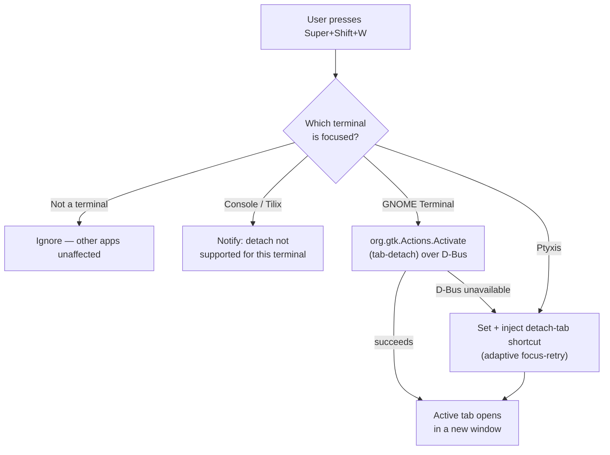
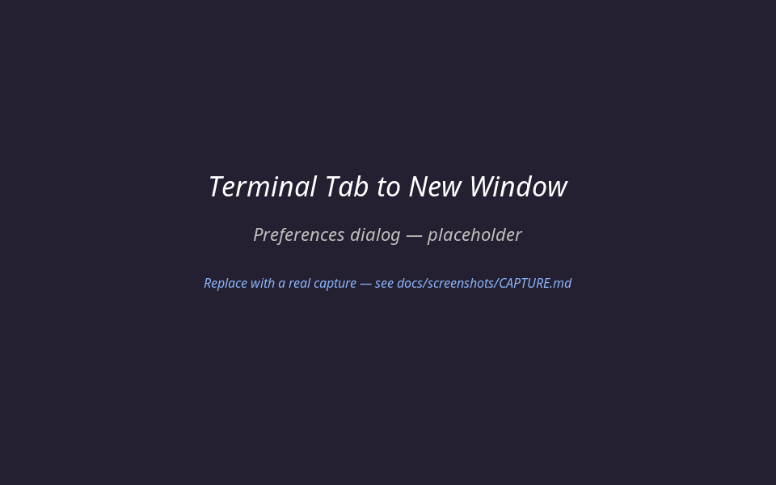
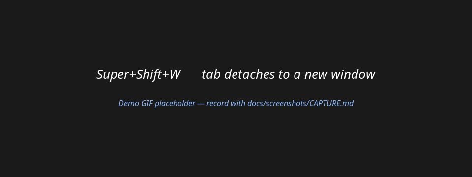

<div align="center">

# Terminal Tab to New Window

[](https://gjs.guide/extensions/)
[](LICENSE)
[](https://ubuntu.com/)
[](https://wiki.gnome.org/Initiatives/Wayland)

A GNOME Shell extension that adds a global keyboard shortcut to detach the active terminal tab into its own window — adaptively across **GNOME Terminal** and **Ptyxis**, on both Wayland and X11.

</div>

> [!NOTE]
> Terminals have no plugin API, so this extension triggers each terminal's own detach action. **GNOME Terminal** is detached directly through its D-Bus window action — no keybinding is touched. **Ptyxis** exposes no such action, so the extension sets its `detach-tab` shortcut (saved and **restored on disable**) and injects it as a synthetic keystroke. Nothing leaves your machine.

## Quick Start

```bash
git clone https://github.com/mralaminahamed/gnome-terminal-tab-to-window.git
cd gnome-terminal-tab-to-window/terminal-tab-to-window@mralaminahamed.github.com
chmod +x install.sh
./install.sh
```

The installer auto-detects your GNOME Shell version, copies the correct variant into `~/.local/share/gnome-shell/extensions/`, compiles the GSettings schema, and enables the extension. Then **restart GNOME Shell** — log out and back in on Wayland, or press `Alt+F2` → `r` → `Enter` on X11.

Open **GNOME Terminal** with at least two tabs and press **`Super+Shift+W`**. The active tab detaches into its own window.

## What It Does

Terminal tab context menus can't be extended without patching each app's source. The only clean, package-update-safe way to add "move tab to new window" behaviour is from **outside** the terminal — a GNOME Shell extension that intercepts a global shortcut and triggers whichever detach action the focused terminal exposes.

Useful when you:

- Split one terminal session into several windows across monitors
- Want a keyboard-only equivalent of dragging a tab out
- Use GNOME Terminal or Ptyxis and miss Tilix-style tab detachment

## Supported terminals

| Terminal | Detach? | Mechanism |
|----------|---------|-----------|
| **GNOME Terminal** | ✅ | D-Bus window action `tab-detach` (`org.gtk.Actions`) — **no keybinding is changed**. Falls back to keystroke injection if D-Bus is unavailable. |
| **Ptyxis** | ✅ | Sets `org.gnome.Ptyxis.Shortcuts` → `detach-tab` (saved/restored) and injects it. |
| GNOME Console (kgx) | ⚠️ | Recognised, but has no accelerator, settable shortcut, or reachable action — you get an explanatory notification. |
| Tilix | ⚠️ | Recognised, but detach is drag-only upstream — explanatory notification. |

The extension picks the right mechanism from the focused window (GNOME Terminal by `WM_CLASS`, GTK4 terminals by application-id).

## How It Works



- **GNOME Terminal** is detached by calling its exported D-Bus window action directly — no keybinding mutation, no injection, no timing guesswork.
- **Ptyxis** has no D-Bus-reachable detach action, so the extension sets its `detach-tab` shortcut (reusing an existing user binding if present, otherwise setting `Ctrl+Shift+Alt+D` and restoring the old value on disable) and injects it via a `Clutter.VirtualInputDevice`. Injection re-checks focus and retries the wait so it fires exactly once, on both Wayland and X11.

## Features

| Feature | Description |
|---------|-------------|
| Global shortcut | Default `Super+Shift+W`, fires only when a supported terminal is focused |
| Adaptive | Detects the focused terminal and uses its best available detach mechanism |
| Non-destructive | GNOME Terminal's keybinding is never touched; any mutated shortcut is restored on disable |
| Configurable | Rebind the shortcut from the preferences dialog or via `gsettings` |
| Wayland & X11 | D-Bus and compositor-level injection — no X11-only APIs |
| Focus guard | Re-checks the focused window right before injecting, so keys never reach another app |
| Diagnostics | Optional verbose-logging toggle; actionable notifications for unsupported/missing terminals |
| Two variants | ESM `extension.js` for GNOME 45–50; `extension-gnome42.js` for GNOME 42–44 |
| No network | No telemetry, analytics, or outbound requests of any kind |

## Screenshots

> [!NOTE]
> The images below are placeholders. See [docs/screenshots/CAPTURE.md](docs/screenshots/CAPTURE.md) for the exact commands to record real captures (keep the same filenames).



<details>
<summary>View the detach demo</summary>



</details>

## Installation

### Automatic (recommended)

```bash
./install.sh            # auto-detects GNOME Shell version
./install.sh --gnome42  # force the GNOME 42–44 variant (Ubuntu 22.04)
```

The installer:

- Copies the correct variant to `~/.local/share/gnome-shell/extensions/terminal-tab-to-window@mralaminahamed.github.com/`
- Copies `prefs.js` (GNOME 45+ only) and compiles the GSettings schema
- Enables the extension via `gnome-extensions enable`
- Sets `Ctrl+Shift+Alt+D` as GNOME Terminal's internal `detach-tab` shortcut

### Restart GNOME Shell

| Session | How |
|---------|-----|
| **Wayland** (Ubuntu 24.04 default) | Log out → log back in |
| **X11** | `Alt+F2` → type `r` → `Enter` |

## Preferences

### Preferences dialog (GNOME 45+)

```bash
gnome-extensions prefs terminal-tab-to-window@mralaminahamed.github.com
```

Or open the **GNOME Extensions** app and click the ⚙ icon. The dialog shows the current shortcut and lets you rebind it — click **Change…** and press the new combination (Backspace clears, Escape cancels). A **Behaviour** group offers a *Verbose logging* switch, and a **Supported terminals** group lists what can be detached.

### Command line

```bash
# Set a custom shortcut (example: Ctrl+Alt+W)
gsettings set org.gnome.shell.extensions.terminal-tab-to-window \
  move-terminal-tab-shortcut "['<Primary><Alt>w']"

# Reset to the default (Super+Shift+W)
gsettings reset org.gnome.shell.extensions.terminal-tab-to-window \
  move-terminal-tab-shortcut

# Turn on verbose logging for troubleshooting
gsettings set org.gnome.shell.extensions.terminal-tab-to-window \
  debug-logging true
```

## Verifying the Installation

```bash
# 1. Confirm the extension is enabled
gnome-extensions list --enabled | grep terminal-tab

# 2. Confirm GNOME Terminal's internal shortcut was set
gsettings get org.gnome.Terminal.Legacy.Keybindings detach-tab
# Expected: '<Primary><Shift><Alt>d'

# 3. Watch GNOME Shell logs for extension messages
journalctl -f /usr/bin/gnome-shell | grep TerminalTabToWindow
```

## Troubleshooting

<details>
<summary>Shortcut does nothing</summary>

1. Confirm GNOME Terminal is the **focused** window when you press the shortcut.
2. Check the internal shortcut is set:
   ```bash
   gsettings get org.gnome.Terminal.Legacy.Keybindings detach-tab
   ```
   If the output is `'disabled'` or empty, run:
   ```bash
   gsettings set org.gnome.Terminal.Legacy.Keybindings detach-tab '<Primary><Shift><Alt>d'
   ```
</details>

<details>
<summary><code>detach-tab</code> key not found in schema</summary>

Some older GNOME Terminal builds omit this key. Verify with:

```bash
gsettings list-keys org.gnome.Terminal.Legacy.Keybindings | grep detach
```

If it is missing, your GNOME Terminal version does not support keyboard-driven tab detachment. Consider [Tilix](https://gnunn1.github.io/tilix-web/), which supports tab drag-out natively.
</details>

<details>
<summary>Extension not loading after install</summary>

Ensure the schema compiled:

```bash
ls ~/.local/share/gnome-shell/extensions/terminal-tab-to-window@mralaminahamed.github.com/schemas/gschemas.compiled
```

If missing:

```bash
glib-compile-schemas \
  ~/.local/share/gnome-shell/extensions/terminal-tab-to-window@mralaminahamed.github.com/schemas/
```

Then restart GNOME Shell.
</details>

<details>
<summary>Wrong GNOME Shell version</summary>

```bash
gnome-shell --version
```

- **GNOME 45–50** → `extension.js` (ES modules, installed by default)
- **GNOME 42–44** → `./install.sh --gnome42` (uses `extension-gnome42.js`)
</details>

## Packaging for extensions.gnome.org

`package.sh` builds clean submission zips with `gnome-extensions pack`, excluding install scripts and the unused variant automatically.

```bash
./package.sh            # GNOME 45+ (ESM) zip  → dist/…​.shell-extension.zip
./package.sh --gnome42  # GNOME 42–44 zip      → dist/…​-gnome42.shell-extension.zip
```

extensions.gnome.org accepts one zip per shell-version range for the same UUID, so the modern and legacy packages are uploaded as two separate submissions.

## Project Structure

```
terminal-tab-to-window@mralaminahamed.github.com/
├── extension.js            # GNOME Shell 45–50 (ES modules)
├── extension-gnome42.js    # GNOME Shell 42–44 (classic imports)
├── prefs.js                # Preferences dialog (GNOME 45+)
├── metadata.json           # UUID, versions, settings-schema
├── schemas/
│   └── org.gnome.shell.extensions.terminal-tab-to-window.gschema.xml
├── po/                     # Translation template + language .po files
│   ├── terminal-tab-to-window.pot
│   └── update-pot.sh
├── docs/screenshots/       # Listing assets (see CAPTURE.md)
│   ├── prefs.png
│   ├── demo.gif
│   └── CAPTURE.md
├── install.sh              # Installer (auto-detects GNOME version)
├── uninstall.sh            # Removes extension, restores terminal keybinding
├── package.sh              # Builds extensions.gnome.org zips
├── CHANGELOG.md
└── README.md
```

## Why Not a True Tab Context Menu?

GNOME Terminal has **no extension or plugin API** in modern versions — the libpeas plugin system was removed in GNOME Terminal 3.x. The only ways to add an item to its tab right-click menu are:

- Patch and recompile the C source — complex, breaks on every package update.
- Use `LD_PRELOAD` to inject a shared library — fragile and security-relevant.

This GNOME Shell extension is the cleanest available alternative: it hooks into the compositor (where there *is* a stable extension API) and drives the terminal through its own keybinding infrastructure. For native drag-to-new-window support, [**Tilix**](https://gnunn1.github.io/tilix-web/) (`sudo apt install tilix`) is a good alternative.

## Translations

The GNOME 45+ preferences dialog is fully translatable (gettext domain `terminal-tab-to-window`). To add a language:

```bash
cd po
./update-pot.sh                                              # refresh the template
msginit --input=terminal-tab-to-window.pot --locale=fr --output=fr.po
# translate fr.po, then rebuild:
cd .. && ./package.sh                                        # compiles po/*.po into locale/
```

`package.sh` compiles every `po/*.po` into `locale/<lang>/LC_MESSAGES/` inside the submission zip automatically.

## Privacy

No network requests, telemetry, or analytics. The extension only reads and writes local GSettings keys (`org.gnome.shell.extensions.terminal-tab-to-window` and `org.gnome.Terminal.Legacy.Keybindings`) and injects local input events. The GNOME Terminal keybinding it changes is restored to its previous value on disable.

## Uninstalling

```bash
chmod +x uninstall.sh
./uninstall.sh
```

Disables the extension, removes its files, and resets GNOME Terminal's `detach-tab` shortcut to the default. Restart GNOME Shell afterwards to complete cleanup.

## Changelog

The full version history lives in [CHANGELOG.md](CHANGELOG.md), in [Keep a Changelog](https://keepachangelog.com/) format.

## Contributing

Bug reports, feature requests, and pull requests are welcome on the [issue tracker](https://github.com/mralaminahamed/gnome-terminal-tab-to-window/issues). Please run `eslint` over JavaScript changes and, where possible, test on both a GNOME 42 (Ubuntu 22.04) and a GNOME 46+ (Ubuntu 24.04) session before submitting.

## Maintainer

Al Amin Ahamed — [alaminahamed.com](https://alaminahamed.com) · [@mralaminahamed](https://github.com/mralaminahamed)

## License

[MIT](LICENSE) © Al Amin Ahamed
